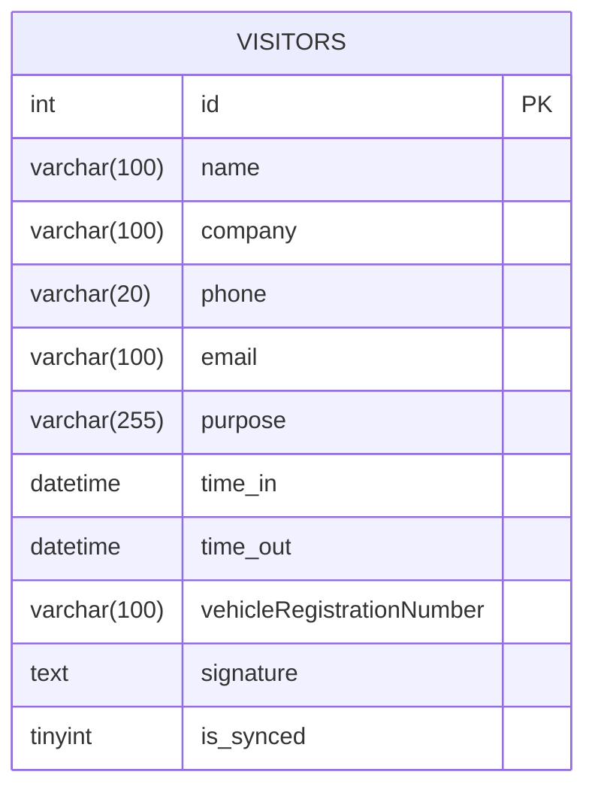
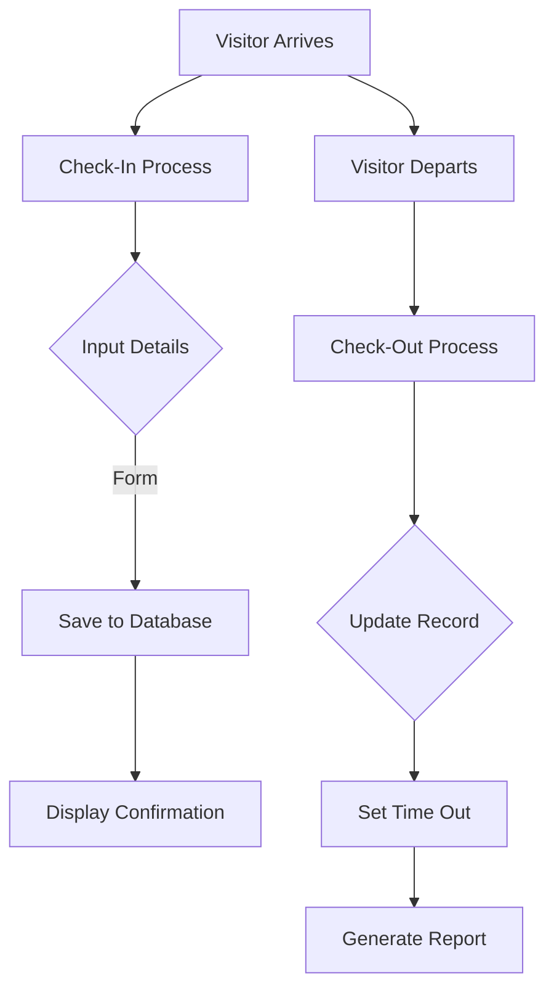
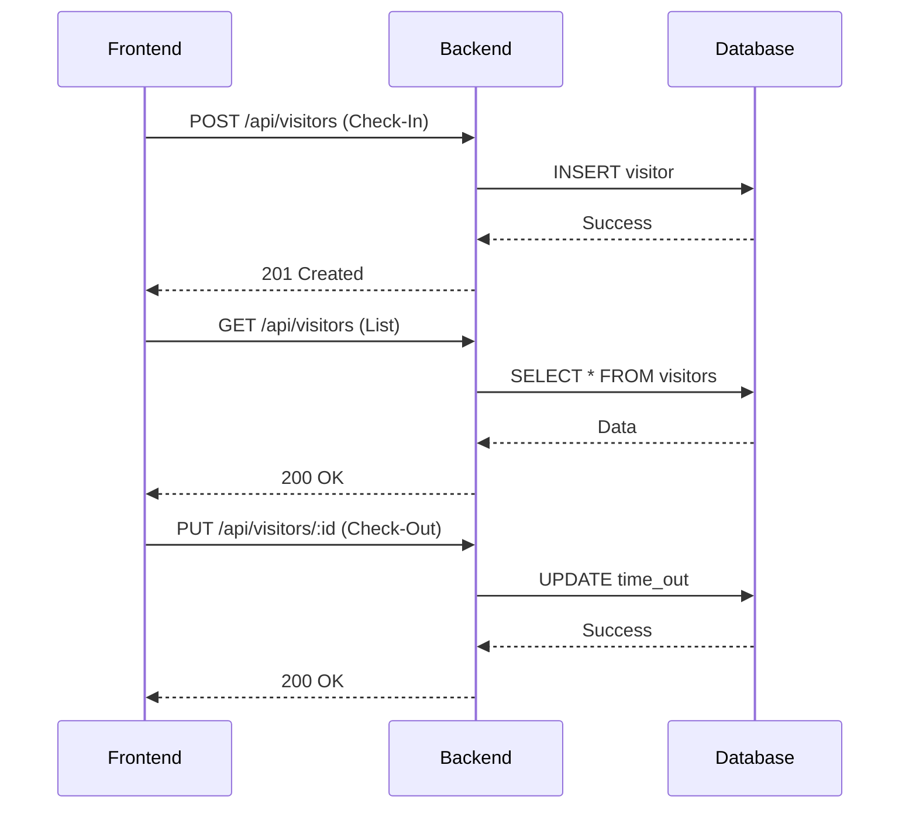
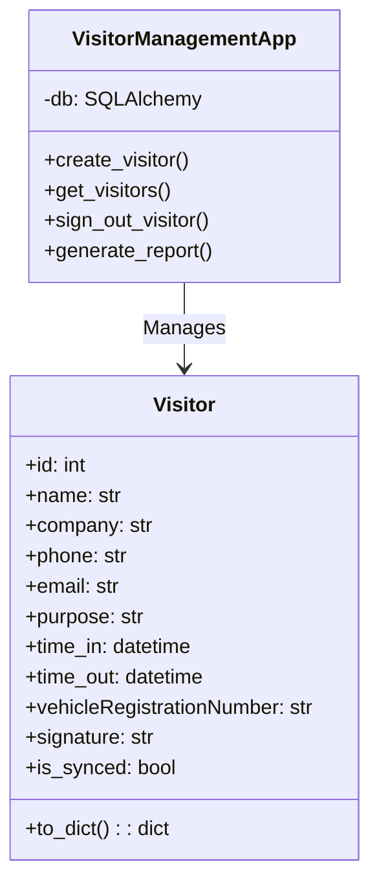
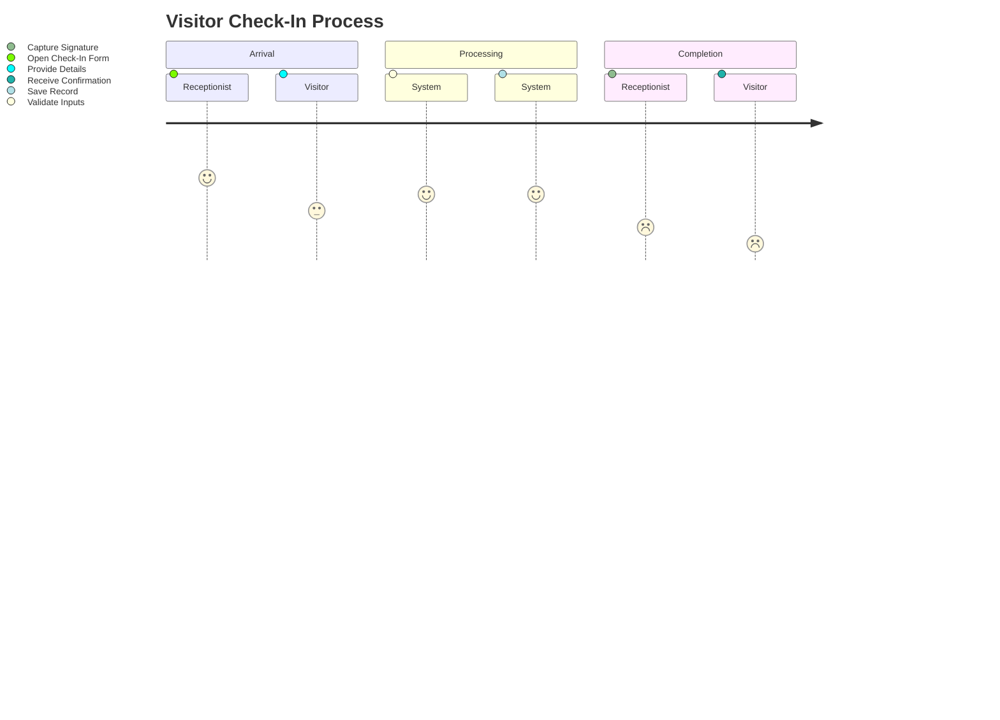
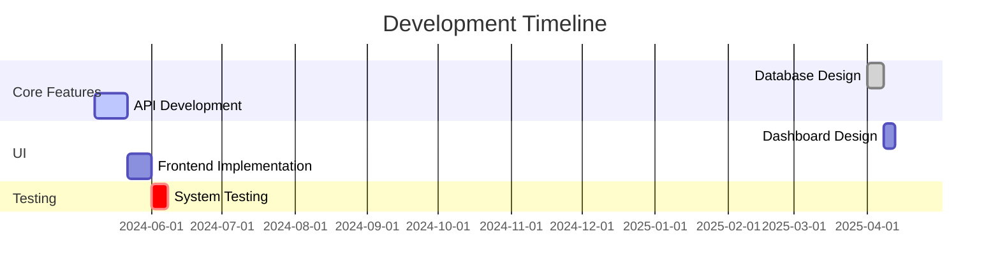
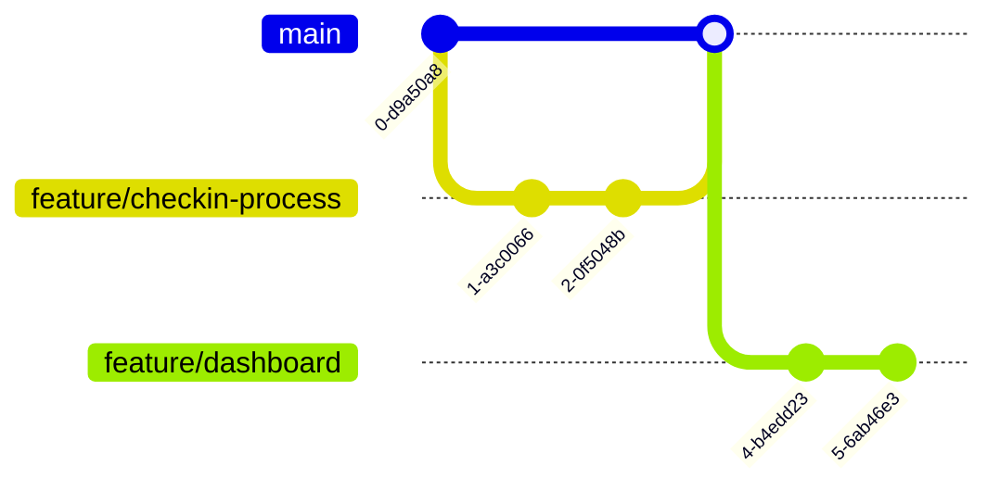
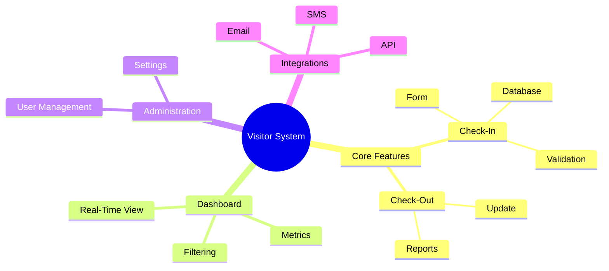
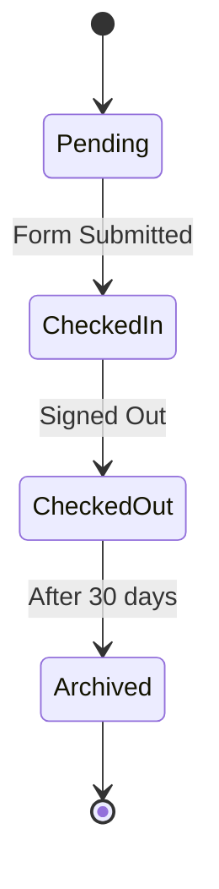

# Azure-Flask-Web-App

Repository: FHS Visitor Management Dashboard
Description

This repository contains the source code for the FHS visitor management dashboard built using Python Flask. 
# Functionality:

   The /api/visitors/export endpoint generates a CSV file with all visitor data

   It respects the same filters as the other endpoints

   The browser will automatically download the file when the endpoint is called

# Filtering Capabilities:

   Date range filtering (start and end dates)

   Purpose filtering

   Signed-in-only filtering

   All filters are applied consistently across all endpoints

# Dashboard Controls:

   Date pickers for selecting date ranges

   Dropdown with all available purposes

   Apply Filters button to refresh data

   Export Data button to download CSV

# Backend Changes:

   All endpoints now support filtering

   New endpoint to get unique purposes for the filter dropdown

# Entity Diagram(Database Schema)

# System Flowchart

# API Sequence Diagram

# Class Diagram

# User Journey Diagram

# Deployment Gantt Chart

# Git Branching Strategy

# Mind Map Of Features

# State Diagram For Visitor Record

# Screenshots

Getting Started
Prerequisites

  * Python 3.x
  * Git

Installation

  Clone the repository:

    git clone https://github.com/thato2-5/Azure-Flask-Web-App.git
    cd Azure-Flask-Web-App

Create and activate a virtual environment:

    python3 -m venv venv
    source venv/bin/activate  # On Windows use `venv\Scripts\activate`

Install dependencies:

    pip install -r requirements.txt

Set up the database:

    flask db init
    flask db migrate -m "Initial migration."
    flask db upgrade

Run the application locally:

    flask run

Deployment
Deploy to Azure App Service

  Login to Azure:

    az login

Create a resource group:

    az group create --name myResourceGroup --location eastus

Create an App Service plan:

    az appservice plan create --name myAppServicePlan --resource-group myResourceGroup --sku FREE

Create a web app:

    az webapp create --resource-group myResourceGroup --plan myAppServicePlan --name myUniqueSurveyAppName --runtime "PYTHON|3.8"

Deploy the application:

    az webapp up --name myUniqueSurveyAppName --resource-group myResourceGroup

Contributing

Contributions are welcome! Please submit a pull request or open an issue to discuss any changes.
License

This project is licensed under the MIT License.
Acknowledgments

    Flask Documentation: https://flask.palletsprojects.com/
    Azure Documentation: https://docs.microsoft.com/en-us/azure/
    Bootstrap: https://getbootstrap.com/
